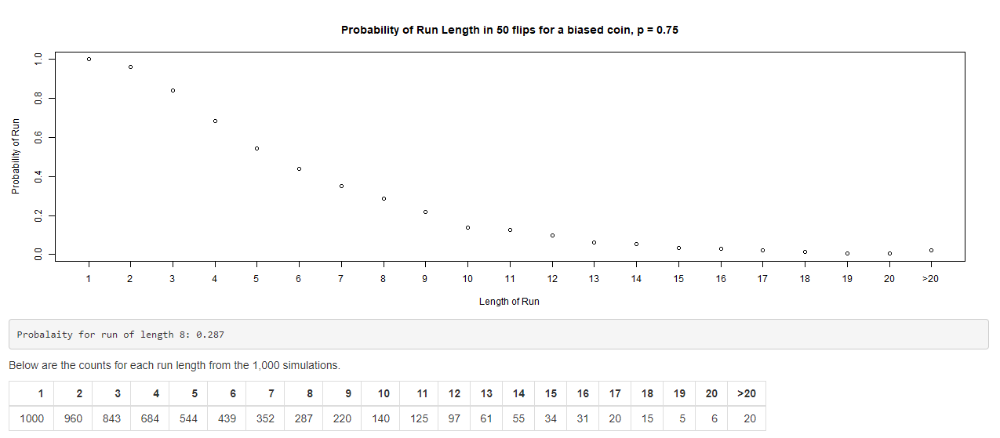

Seeing Patterns in the Noise
========================================================
author: Alan O'S
date: 23 August 2018
width: 1440
height: 900

It is common to see patterns where none exist. We may  
intuitively believe that natural variation indicates a pattern.  
- Why does the disease appear more often in that county?
- If they've won the last four games; they're on a streak!
- The wheel came up red the last three times - is it a fix?  

This project examines random "*patterns*" in a fun and interactive way,  
with simulated flips of a coin. We show that random isn't even.  
**Random is Lumpy!**

Simulated Flips
========================================================
left: 35%
To estimate the probability of a run of successes (or failures) in a series of coin flips, we first count the length of all *runs* of 1 or 0 in a **user-selected** length of random binomials - function "runs" not shown here.  

Simulating this for 1,000 series of coin flips & expressing as a percentage, provides the probability estimate.  
***


```r
runCounts <- function(n, times, p = 0.5, m = 20) {
    z <- runs(n, p, m); i <- 1
    while(i < times){
        z <- rbind(z, runs(n, p, m)); i <- i+1
        }
    counts <- times - apply(z, 2, function(x) sum(x == 0))
    counts
}
#10 flips of a balanced coin (p=0.5) 1,000 times, as percentage
runCounts(10, 1000, 0.5, 10)/1000
```

```
    1     2     3     4     5     6     7     8     9    10   >10 
0.875 0.789 0.557 0.282 0.151 0.059 0.024 0.009 0.001 0.003 0.000 
```


User Interaction
========================================================
Using a shiny web app allows the user to interact and see the effect of altering the number of coin flips or the fairness of the coin on the probability of *patterns* appearing.  

```r
# Not run - sample code from server.R
output$runsPlot <- renderPlot({
  plot(cts()/1000, xlab = "Length of Run", ylab = "Probability of Run", xaxt = "n")
  axis(1, at = seq(1:length(cts())), labels = names(cts()))
})
output$runsTable <- renderTable({
    t(cts())
},
digits = 0, bordered = TRUE
)
output$hoverp <- renderText({
    hover <- input$plot_hover
    dist <- sqrt((hover$y - cts()/1000)^2 + ((hover$x - 1:length(cts()))/10)^2)
    if(is.null(hover) || min(dist) > 0.05) {
        out <- "Hover over a point for the probability"}
    else out <- paste0("For run of length ", names(cts())[which.min(dist)], 
                       ": p = ", (cts()[which.min(dist)])/1000)
    out
})
```

Feedback
========================================================

The user receives immediate feedback showing any alterations in the ouput and can check the changed probabilities by hovering over points with the mouse.


Conclusion
========================================================

We have shown a simple and interactive demonstration of the shiny app that informs the user about the likelihood of apparent patterns in random data.  

[Click here for Shiny App](https://acos.shinyapps.io/coinflipruns/)

This project has been completed for the Developing Data products course from Johns Hopkins University on Coursera.
